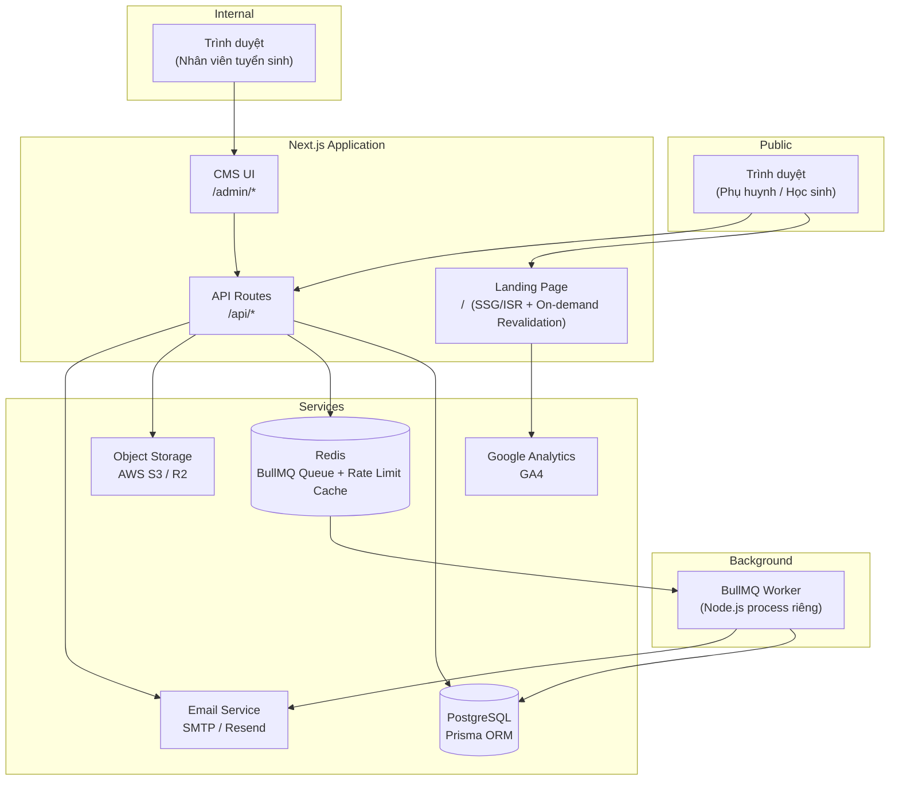
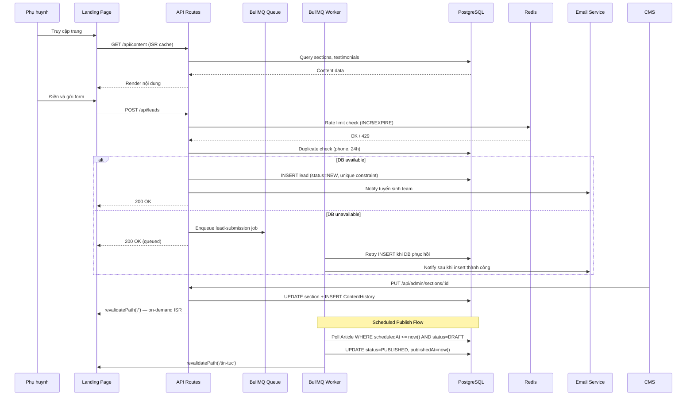
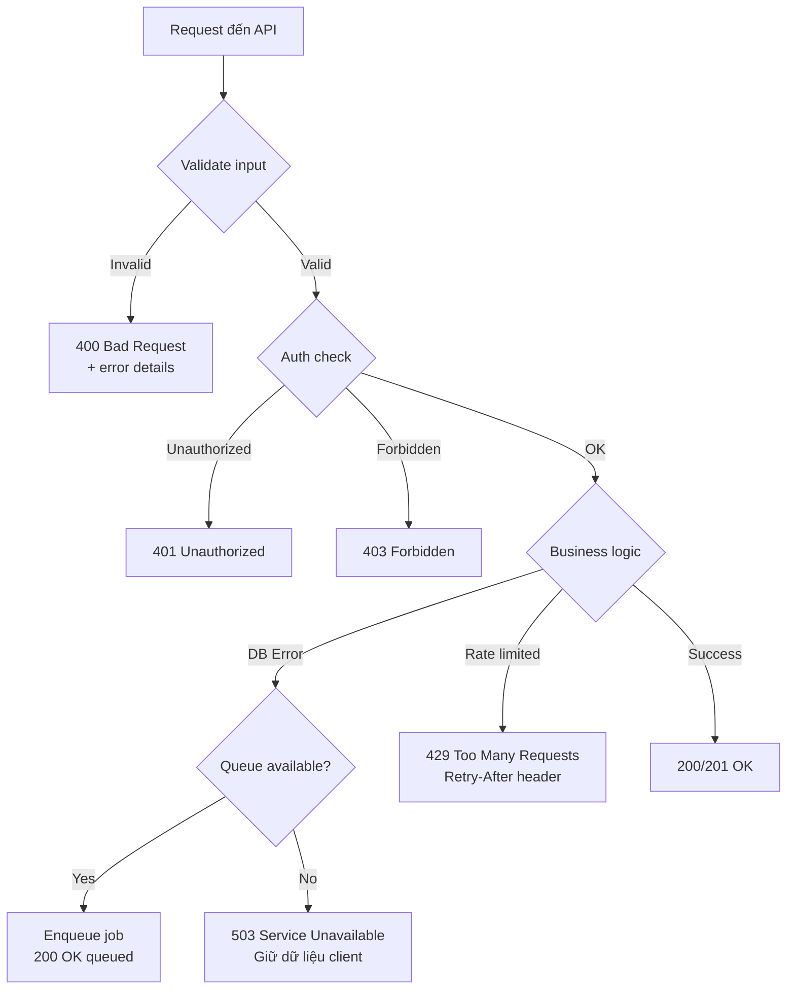

# Tài Liệu Thiết Kế

## Landing Page + CMS Quản Lý Tuyển Sinh Trường THPT

---

## Tổng Quan

Hệ thống bao gồm hai thành phần chính được triển khai như một ứng dụng web full-stack:

1. **Landing Page công khai** — trang giới thiệu trường THPT, tối ưu SEO, hiệu năng cao, responsive trên mọi thiết bị. Nội dung được quản lý động qua CMS.
2. **CMS nội bộ** — hệ thống quản lý nội dung dành cho đội tuyển sinh, bao gồm quản lý section, bài viết, lead và báo cáo thống kê.

### Mục Tiêu Kỹ Thuật

- Thời gian tải trang ≤ 3 giây trên 4G; PageSpeed ≥ 80 (mobile), ≥ 90 (desktop)
- Uptime ≥ 99.5% trong mùa tuyển sinh
- Conversion Rate ≥ 8%, Bounce Rate ≤ 50%
- Bảo mật dữ liệu lead theo tiêu chuẩn HTTPS + bcrypt

### Quyết Định Kiến Trúc

| Quyết định | Lựa chọn | Lý do |
|---|---|---|
| Frontend framework | Next.js (React) | SSR/SSG cho SEO, App Router, Image Optimization tích hợp |
| Backend/API | Next.js API Routes + Node.js | Monorepo đơn giản, chia sẻ type |
| Database | PostgreSQL | Quan hệ rõ ràng giữa Lead, User, Content; hỗ trợ JSON cho nội dung linh hoạt |
| ORM | Prisma | Type-safe, migration tự động |
| Auth | NextAuth.js (JWT + session) | Tích hợp sẵn với Next.js, hỗ trợ role-based |
| File storage | AWS S3 / Cloudflare R2 | Lưu trữ ảnh tải lên, CDN tích hợp |
| Image processing | Sharp (server-side) | Nén ảnh, chuyển đổi WebP |
| Email | Nodemailer + SMTP / Resend | Gửi thông báo lead, reset password |
| Queue | BullMQ + Redis | Xử lý form submission khi DB tạm thời không khả dụng; scheduled publish |
| Rich text editor | TipTap | Headless, extensible, hỗ trợ tiếng Việt |
| Styling | Tailwind CSS | Utility-first, responsive dễ dàng |
| Validation schema | Zod | Runtime validation cho Section.content JSON và API input |
| Property-based testing | fast-check (TypeScript) | Thư viện PBT phổ biến cho JS/TS |

---

## Hệ Thống Thiết Kế (Design System)

Hệ thống UI tuân theo **Apple Design System** — tối giản, tinh tế, ưu tiên whitespace và typography. Toàn bộ Landing Page và CMS sử dụng thống nhất các token sau.

### Bảng Màu

| Token | Giá trị | Sử dụng |
|---|---|---|
| Primary Action Blue | `#0071E3` | Nút CTA chính, trạng thái active, link tương tác |
| Primary Blue Hover | `#006EDB` | Hover state của primary blue |
| Primary Blue Press | `#0076DF` | Active/pressed state |
| Text Dominant | `#1D1D1F` | Toàn bộ body text, heading chính |
| Text Secondary | `#333336` | Subheading, nội dung phụ |
| Text Tertiary | `#6E6E73` | Caption, meta, placeholder |
| Neutral Lightest | `#FFFFFF` | Background trang, card surface |
| Surface Light | `#EDEDF2` | Border card, divider, background nhẹ |
| Navigation Surface | `rgba(255,255,255,0.8)` | Sticky nav với frosted-glass effect |
| Neutral Dark Medium | `#272729` | Dark surface, footer background |
| Overlay Soft | `rgba(0,0,0,0.8)` | Overlay text muted |

### Typography

**Font chính:** SF Pro Text, -apple-system, BlinkMacSystemFont, "Segoe UI", Roboto, sans-serif
**Font display:** SF Pro Display, -apple-system, BlinkMacSystemFont, "Segoe UI", Roboto, sans-serif

| Role | Font | Size | Weight | Line Height | Dùng cho |
|---|---|---|---|---|---|
| Display Hero | SF Pro Display | 40px | 600 | 44px | Hero headline |
| Heading Large | SF Pro Display | 28px | 400 | 32px | Section heading |
| Heading Primary | SF Pro Display | 24px | 600 | 28px | Card title |
| Heading Secondary | SF Pro Text | 34px | 600 | 50px | Prominent subheading |
| Body Default | SF Pro Text | 17px | 400 | 25px | Body text |
| Body Compact | SF Pro Text | 17px | 400 | 21px | Nav link |
| Small Label | SF Pro Text | 12px | 400 | 16px | Caption, meta |
| Button | SF Pro Text | 17px | 400 | 25px | Button text |
| Link | SF Pro Text | 17px | 600 | 21px | Interactive link |

*Responsive: giảm Display Hero xuống 28px trên tablet, 24px trên mobile.*

### Components

#### Buttons

| Loại | Background | Text | Border | Border Radius | Height |
|---|---|---|---|---|---|
| Primary | `#0071E3` | `#FFFFFF` | none | 50% | 44px |
| Secondary | transparent | `#0071E3` | `2px solid #0071E3` | 50% | 44px |
| Ghost | transparent | `#1D1D1F` | none | 0px | 44px |

- Hover Primary: background `#006EDB`
- Hover Secondary: background `rgba(0,113,227,0.05)`, border `#006EDB`
- Padding: `12px 24px` (Primary/Secondary), `12px 8px` (Ghost)

#### Navigation Bar (Sticky)

- Background: `rgba(255,255,255,0.8)` + `backdrop-filter: blur(20px)`
- Border bottom: `1px solid rgba(0,0,0,0.1)`
- Height: 44px
- Nav link: color `rgba(0,0,0,0.8)`, hover `#0071E3`, font weight 600

#### Cards

- **Hero Card:** background `#FFFFFF`, padding `48px`, min-height `580px`, max-width `1262px`, border-radius `0px`
- **Feature Card:** border `1px solid #EDEDF2`, padding `32px 40px`, border-radius `0px`
- Không dùng box-shadow trên card thông thường; chỉ dùng shadow cho modal/popover

#### Form Inputs

- Height: 44px, border-radius: 8px
- Border: `1px solid #D5D5D7`, focus: `#0071E3` + `box-shadow: 0 0 0 3px rgba(0,113,227,0.1)`
- Placeholder: `#6E6E73`, label: 12px weight 600

### Spacing System

Base unit: 4px. Các giá trị thường dùng: `8 / 12 / 16 / 20 / 24 / 32 / 40 / 48 / 56px`.

- Padding trong card: 24–32px
- Khoảng cách giữa sections: 40–56px
- Container max-width: **1262px**, căn giữa với margin tự động

### Responsive Breakpoints

| Breakpoint | Width | Layout |
|---|---|---|
| Mobile | 320–767px | 1 cột, padding 16–24px, hamburger menu |
| Tablet | 768–1023px | 2 cột, padding 24–32px |
| Desktop | 1024–1440px | 3 cột, max-width 1262px |
| Large Desktop | 1441px+ | 3 cột, container căn giữa |

---

## Cấu Trúc Thư Mục Dự Án

```
src/
├── app/
│   ├── (public)/                    # Landing Page routes
│   │   ├── layout.tsx               # Public layout + StickyNav
│   │   ├── page.tsx                 # Trang chủ (SSG/ISR)
│   │   ├── tin-tuc/
│   │   │   ├── page.tsx             # Danh sách bài viết
│   │   │   └── [slug]/
│   │   │       └── page.tsx         # Chi tiết bài viết
│   │   └── chinh-sach-bao-mat/
│   │       └── page.tsx             # Trang chính sách bảo mật
│   ├── admin/                       # CMS routes (protected)
│   │   ├── layout.tsx               # CMS layout + sidebar
│   │   ├── login/page.tsx
│   │   ├── dashboard/page.tsx
│   │   ├── content/page.tsx
│   │   ├── articles/
│   │   │   ├── page.tsx
│   │   │   └── [id]/page.tsx
│   │   ├── leads/page.tsx
│   │   └── users/page.tsx           # Admin only
│   ├── api/
│   │   ├── auth/[...nextauth]/route.ts
│   │   ├── content/route.ts
│   │   ├── articles/
│   │   │   ├── route.ts
│   │   │   └── [slug]/route.ts
│   │   ├── leads/route.ts
│   │   └── admin/
│   │       ├── sections/[id]/route.ts
│   │       ├── articles/[id]/route.ts
│   │       ├── leads/
│   │       │   ├── route.ts
│   │       │   ├── export/route.ts
│   │       │   └── [id]/route.ts
│   │       ├── reports/route.ts
│   │       ├── users/[id]/route.ts
│   │       └── upload/route.ts
│   ├── maintenance/page.tsx
│   ├── not-found.tsx
│   ├── error.tsx
│   ├── sitemap.ts
│   └── robots.ts
├── components/
│   ├── landing/                     # Landing Page components
│   │   ├── StickyNav.tsx
│   │   ├── HeroSection.tsx
│   │   ├── IntroSection.tsx
│   │   ├── ProgramSection.tsx
│   │   ├── AchievementSection.tsx
│   │   ├── FacilitySection.tsx
│   │   ├── ExtracurricularSection.tsx
│   │   ├── TeacherSection.tsx
│   │   ├── AdmissionSection.tsx
│   │   ├── TuitionSection.tsx
│   │   ├── TestimonialSection.tsx
│   │   ├── RegistrationForm.tsx
│   │   ├── FloatingCTA.tsx
│   │   └── Footer.tsx
│   ├── cms/                         # CMS UI components
│   │   ├── Sidebar.tsx
│   │   ├── SectionEditor.tsx
│   │   ├── ArticleEditor.tsx
│   │   ├── LeadTable.tsx
│   │   └── Dashboard.tsx
│   └── ui/                          # Shared UI primitives
│       ├── Button.tsx
│       ├── Input.tsx
│       ├── Modal.tsx
│       └── Chart.tsx
├── lib/
│   ├── validation.ts
│   ├── slug.ts
│   ├── rate-limit.ts        # Redis-based rate limiting
│   ├── audit.ts
│   ├── email.ts
│   └── revalidate.ts        # On-demand ISR revalidation helpers
├── schemas/                 # Zod schemas cho Section content + API input
│   ├── section-content.ts   # HeroContent, TeacherContent, v.v.
│   └── api.ts               # Request/response schemas
├── workers/
│   ├── lead-submission.worker.ts
│   └── scheduled-publish.worker.ts   # Xử lý Article scheduled publish
└── types/
    └── index.ts
```

---

### Sơ Đồ Tổng Thể



### Luồng Dữ Liệu Chính



### Kiến Trúc Phân Lớp

```
┌─────────────────────────────────────────────┐
│              Presentation Layer              │
│   Landing Page (SSG/ISR)  │  CMS UI (CSR)   │
├─────────────────────────────────────────────┤
│               API Layer                      │
│         Next.js API Routes (/api/*)          │
├─────────────────────────────────────────────┤
│             Business Logic Layer             │
│  LeadService │ ContentService │ AuthService  │
│  ArticleService │ ReportService              │
├─────────────────────────────────────────────┤
│              Data Access Layer               │
│         Prisma ORM + Repository Pattern      │
├─────────────────────────────────────────────┤
│               Infrastructure                 │
│  PostgreSQL │ Redis │ S3 │ Email │ BullMQ    │
└─────────────────────────────────────────────┘
```

### Worker Deployment Strategy

BullMQ worker **không thể chạy trong Next.js API Routes** (serverless/edge). Worker phải là một Node.js process riêng biệt:

```
# Cấu trúc deployment
├── Next.js App (port 3000)          — API Routes + SSR/ISR
└── Worker Process (src/workers/)    — BullMQ consumer, chạy liên tục

# Khởi động worker
node src/workers/lead-submission.worker.ts

# Production: dùng PM2 hoặc Docker container riêng
pm2 start src/workers/lead-submission.worker.ts --name "lead-worker"
```

**docker-compose.yml** phải bao gồm service riêng cho worker:
```yaml
services:
  app:       # Next.js
  worker:    # BullMQ worker (same codebase, different entrypoint)
  postgres:
  redis:
```

Worker xử lý 2 loại job:
1. **`lead-submission`** — retry INSERT lead khi DB phục hồi
2. **`scheduled-publish`** — publish Article khi `scheduledAt <= now()`

---

## Thành Phần và Giao Diện

### 1. Landing Page Components

#### 1.1 Navigation (Sticky)
- Component: `<StickyNav sections={sections} />`
- Behavior: Cố định khi cuộn, highlight section đang xem (Intersection Observer)
- Smooth scroll đến section khi click (≤ 500ms)

#### 1.2 Section Components
Mỗi section được render từ dữ liệu CMS:

```typescript
interface SectionProps {
  id: string;           // anchor id cho smooth scroll
  type: SectionType;    // HERO | INTRO | PROGRAM | ACHIEVEMENT | FACILITY | ...
  content: SectionContent; // JSON content từ DB
  isVisible: boolean;   // toggle hiển thị từ CMS
}
```

| Section | Component | Nội dung chính |
|---|---|---|
| Hero | `<HeroSection>` | Tiêu đề, tiêu đề phụ, background, CTA button |
| Giới thiệu | `<IntroSection>` | Văn bản, hình ảnh, số liệu nổi bật |
| Chương trình | `<ProgramSection>` | Danh sách chương trình, mô tả |
| Thành tích | `<AchievementSection>` | Số liệu, giải thưởng, tỷ lệ đỗ ĐH |
| Cơ sở vật chất | `<FacilitySection>` | Gallery ảnh, mô tả |
| Ngoại khóa | `<ExtracurricularSection>` | Danh sách CLB, hoạt động |
| Giáo viên | `<TeacherSection>` | Danh sách giáo viên, profile |
| Tuyển sinh | `<AdmissionSection>` | Quy trình, điều kiện |
| Học phí | `<TuitionSection>` | Bảng học phí, chính sách |
| Testimonials | `<TestimonialSection>` | Carousel đánh giá |
| Form đăng ký | `<RegistrationForm>` | Form lead capture |
| Footer | `<Footer>` | Thông tin liên hệ, links |

#### 1.3 Registration Form
```typescript
interface RegistrationFormData {
  parentName: string;       // bắt buộc
  phone: string;            // bắt buộc, 10 chữ số bắt đầu 0
  email?: string;           // tùy chọn, định dạng email
  studentName: string;      // bắt buộc
  expectedYear: number;     // bắt buộc, năm học dự kiến
  note?: string;            // tùy chọn
  privacyConsent: boolean;  // bắt buộc, phải = true
}

interface FormValidationResult {
  isValid: boolean;
  errors: Record<keyof RegistrationFormData, string | undefined>;
}
```

**Validation Rules:**
- `phone`: regex `/^0\d{9}$/`
- `email`: regex RFC 5322 simplified `/^[^\s@]+@[^\s@]+\.[^\s@]+$/`
- `parentName`, `studentName`: không rỗng, không chỉ whitespace
- `expectedYear`: số nguyên, năm hiện tại đến năm hiện tại + 5
- `privacyConsent`: phải là `true`

#### 1.4 Floating CTA (Mobile)
- Fixed bottom bar trên mobile (< 768px)
- Nút "Đăng ký ngay" → scroll đến `#registration-form`

### 2. CMS Components

#### 2.1 Authentication
- Route: `/admin/login`
- NextAuth.js với Credentials Provider
- JWT token lưu trong httpOnly cookie với `SameSite=Strict` để mitigate CSRF
- Session timeout: 8 giờ từ lần hoạt động cuối (sliding window)
- Account lockout: 5 lần sai → khóa 15 phút
- **CSRF protection**: NextAuth.js tự động thêm CSRF token cho form actions. Các mutating API routes (`PUT`, `PATCH`, `POST`, `DELETE`) verify `Origin` header khớp với domain để chặn cross-origin requests.

#### 2.2 Content Editor
- Route: `/admin/content`
- Danh sách sections với toggle hiển thị
- Inline editor cho từng section
- Preview panel (iframe hoặc side-by-side)
- Lịch sử chỉnh sửa (30 ngày)

#### 2.3 Article Manager
- Route: `/admin/articles`
- Danh sách bài viết với filter/search/pagination (20/trang)
- TipTap rich text editor
- Trạng thái: Draft → Pending → Published / Archived
- Scheduled publish — BullMQ `scheduled-publish` worker poll `scheduledAt <= now()` mỗi phút, update `status=PUBLISHED` và gọi `revalidateArticle(slug)`
- Auto-generate slug từ tiêu đề

#### 2.4 Lead Manager
- Route: `/admin/leads`
- Danh sách lead với filter/search/pagination (50/trang)
- Cập nhật trạng thái + lịch sử
- Gán nhân viên phụ trách
- Thêm ghi chú
- Export Excel (.xlsx)

#### 2.5 Dashboard & Reports
- Route: `/admin/dashboard`
- KPI cards: tổng lead, lead mới hôm nay/tuần/tháng
- Biểu đồ line chart: lead theo thời gian (12 tháng)
- Pie chart: phân bổ theo trạng thái
- Filter theo khoảng thời gian
- Tích hợp GA4 metrics (nếu được cấu hình)

#### 2.6 User Management
- Route: `/admin/users` (chỉ Quan_Tri_Vien)
- CRUD tài khoản Nhan_Vien_Tuyen_Sinh
- Reset password → gửi email link (24h)

### 3. Public Article Pages

#### 3.1 Trang Danh Sách Bài Viết (`/tin-tuc`)
- SSG với ISR revalidate 60 giây
- Hiển thị bài viết `status = PUBLISHED`, sắp xếp theo `publishedAt` giảm dần
- Phân trang 12 bài/trang
- Mỗi card bài viết: ảnh đại diện, tiêu đề, danh mục, ngày xuất bản, đoạn trích

#### 3.2 Trang Chi Tiết Bài Viết (`/tin-tuc/[slug]`)
- SSG với ISR revalidate 60 giây
- `generateStaticParams` cho tất cả bài viết đã xuất bản
- 404 nếu slug không tồn tại hoặc `status ≠ PUBLISHED`
- Hiển thị: ảnh đại diện, tiêu đề (H1), danh mục, ngày xuất bản, nội dung HTML từ TipTap
- Open Graph tags riêng cho từng bài viết

#### 3.3 Trang Chính Sách Bảo Mật (`/chinh-sach-bao-mat`)
- Static page (không cần ISR)
- Meta tag `noindex` để không index trên Google
- Nội dung quản lý qua CMS hoặc hardcode

### 4. API Interfaces

#### 4.1 Public API (Landing Page)

| Method | Endpoint | Mô tả |
|---|---|---|
| GET | `/api/content` | Lấy toàn bộ nội dung sections (cached ISR) |
| GET | `/api/articles` | Danh sách bài viết đã xuất bản (phân trang 12/trang) |
| GET | `/api/articles/:slug` | Chi tiết bài viết |
| POST | `/api/leads` | Gửi form đăng ký (rate limited, duplicate check) |

#### 4.2 CMS API (Protected, requires auth)

| Method | Endpoint | Mô tả |
|---|---|---|
| POST | `/api/auth/login` | Đăng nhập |
| POST | `/api/auth/logout` | Đăng xuất |
| GET | `/api/admin/sections` | Danh sách sections |
| PUT | `/api/admin/sections/:id` | Cập nhật nội dung section |
| GET | `/api/admin/sections/:id/history` | Lịch sử chỉnh sửa |
| POST | `/api/admin/sections/:id/restore` | Khôi phục phiên bản |
| GET | `/api/admin/articles` | Danh sách bài viết |
| POST | `/api/admin/articles` | Tạo bài viết |
| PUT | `/api/admin/articles/:id` | Cập nhật bài viết |
| DELETE | `/api/admin/articles/:id` | Xóa bài viết |
| GET | `/api/admin/leads` | Danh sách lead |
| PATCH | `/api/admin/leads/:id` | Cập nhật trạng thái/ghi chú |
| POST | `/api/admin/leads/:id/assign` | Gán nhân viên |
| GET | `/api/admin/leads/export` | Export Excel |
| GET | `/api/admin/reports` | Dữ liệu báo cáo |
| GET | `/api/admin/users` | Danh sách users (Admin only) |
| POST | `/api/admin/users` | Tạo user (Admin only) |
| PUT | `/api/admin/users/:id` | Cập nhật user (Admin only) |
| POST | `/api/admin/users/:id/reset-password` | Reset password |
| POST | `/api/admin/upload` | Upload ảnh |

---

## Mô Hình Dữ Liệu

### Schema Prisma

```prisma
// Người dùng CMS
model User {
  id            String    @id @default(cuid())
  email         String    @unique
  passwordHash  String    // bcrypt, cost factor >= 12
  name          String
  role          UserRole  @default(STAFF)
  isActive      Boolean   @default(true)
  failedLoginAttempts Int @default(0)
  lockedUntil   DateTime?
  createdAt     DateTime  @default(now())
  updatedAt     DateTime  @updatedAt

  // Relations
  assignedLeads Lead[]    @relation("AssignedTo")
  leadNotes     LeadNote[]
  contentEdits  ContentHistory[]
  auditLogs     AuditLog[]
  exportLogs    ExportLog[]
  articles      Article[]
  leadStatusChanges LeadStatusHistory[]
}

enum UserRole {
  ADMIN   // Quan_Tri_Vien
  STAFF   // Nhan_Vien_Tuyen_Sinh
}

// Section nội dung Landing Page
// Section.content được validate bằng Zod schema (src/schemas/section-content.ts) trước khi lưu
model Section {
  id          String      @id @default(cuid())
  type        SectionType @unique
  title       String      // tên hiển thị trong CMS
  content     Json        // nội dung linh hoạt theo từng section type
  isVisible   Boolean     @default(true)
  order       Int         // thứ tự hiển thị
  updatedAt   DateTime    @updatedAt

  history     ContentHistory[]
}

enum SectionType {
  HERO
  INTRO
  PROGRAM
  ACHIEVEMENT
  FACILITY
  EXTRACURRICULAR
  TEACHER
  ADMISSION
  TUITION
  TESTIMONIAL
  FOOTER
}

// Lịch sử chỉnh sửa nội dung — cleanup job xóa records > 30 ngày
model ContentHistory {
  id            String    @id @default(cuid())
  sectionId     String
  section       Section   @relation(fields: [sectionId], references: [id])
  editorId      String
  editor        User      @relation(fields: [editorId], references: [id])
  contentBefore Json
  contentAfter  Json
  createdAt     DateTime  @default(now())

  @@index([sectionId, createdAt])
  @@index([createdAt])  // cho cleanup job WHERE createdAt < now() - 30 days
}

// Bài viết
model Article {
  id            String        @id @default(cuid())
  title         String
  slug          String        @unique
  content       String        // HTML từ TipTap
  excerpt       String?
  coverImage    String?       // URL ảnh đại diện
  category      String
  status        ArticleStatus @default(DRAFT)
  publishedAt   DateTime?
  scheduledAt   DateTime?     // lên lịch xuất bản — BullMQ scheduled-publish worker poll field này
  authorId      String
  author        User          @relation(fields: [authorId], references: [id])
  createdAt     DateTime      @default(now())
  updatedAt     DateTime      @updatedAt

  @@index([status, publishedAt])
  @@index([slug])
  @@index([scheduledAt])  // cho worker poll scheduled articles
}

enum ArticleStatus {
  DRAFT
  PENDING
  PUBLISHED
  ARCHIVED
}

// Lead đăng ký tư vấn
// Unique constraint (phone, createdAt window) được enforce ở application layer với DB unique index
model Lead {
  id              String      @id @default(cuid())
  parentName      String
  phone           String
  email           String?
  studentName     String
  expectedYear    Int
  note            String?
  status          LeadStatus  @default(NEW)
  assignedToId    String?
  assignedTo      User?       @relation("AssignedTo", fields: [assignedToId], references: [id])
  privacyConsent  Boolean     @default(true)
  sourceIp        String?     // cho rate limiting và audit
  createdAt       DateTime    @default(now())
  updatedAt       DateTime    @updatedAt

  statusHistory   LeadStatusHistory[]
  notes           LeadNote[]

  @@index([status])
  @@index([createdAt])
  @@index([phone])
  @@index([phone, createdAt])  // cho duplicate check query
}

enum LeadStatus {
  NEW           // Mới
  CONTACTED     // Đã liên hệ
  CONSULTING    // Đang tư vấn
  REGISTERED    // Đã đăng ký
  DROPPED       // Không tiếp tục
}

// Lịch sử thay đổi trạng thái Lead
model LeadStatusHistory {
  id          String      @id @default(cuid())
  leadId      String
  lead        Lead        @relation(fields: [leadId], references: [id])
  fromStatus  LeadStatus?
  toStatus    LeadStatus
  changedById String
  changedBy   User        @relation(fields: [changedById], references: [id])
  changedAt   DateTime    @default(now())

  @@index([leadId, changedAt])
}

// Ghi chú Lead
model LeadNote {
  id        String    @id @default(cuid())
  leadId    String
  lead      Lead      @relation(fields: [leadId], references: [id])
  authorId  String
  author    User      @relation(fields: [authorId], references: [id])
  content   String
  createdAt DateTime  @default(now())

  @@index([leadId])
}

// Audit log
model AuditLog {
  id         String    @id @default(cuid())
  userId     String?
  user       User?     @relation(fields: [userId], references: [id])
  action     String    // LOGIN, LOGOUT, CONTENT_UPDATE, LEAD_EXPORT, ...
  resource   String?
  resourceId String?
  metadata   Json?
  ip         String?
  createdAt  DateTime  @default(now())

  @@index([userId, createdAt])
  @@index([action, createdAt])
}

// Log xuất dữ liệu
model ExportLog {
  id           String    @id @default(cuid())
  exportedById String
  exportedBy   User      @relation(fields: [exportedById], references: [id])
  recordCount  Int
  filters      Json?
  createdAt    DateTime  @default(now())
}

// NOTE: RateLimit KHÔNG dùng PostgreSQL model.
// Rate limiting được implement bằng Redis (xem src/lib/rate-limit.ts):
//   INCR key → EXPIRE key windowSeconds → check count > limit
// Lý do: Redis INCR/EXPIRE là atomic, O(1), tự expire — phù hợp hơn DB quan hệ cho hot path.
```

### Cấu Trúc JSON Content cho Section

Mỗi `Section.content` là JSON linh hoạt theo `SectionType`. **Bắt buộc validate bằng Zod trước khi lưu vào DB** để tránh Landing Page crash khi render dữ liệu sai cấu trúc.

```typescript
// src/schemas/section-content.ts
import { z } from 'zod';

export const HeroContentSchema = z.object({
  headline: z.string().min(1),
  subheadline: z.string().min(1),
  backgroundType: z.enum(['image', 'video']),
  backgroundUrl: z.string().url(),
  ctaText: z.string().min(1),
  ctaTarget: z.string().default('#registration-form'),
});

export const TeacherContentSchema = z.object({
  teachers: z.array(z.object({
    name: z.string().min(1),
    subject: z.string().min(1),
    bio: z.string(),
    avatarUrl: z.string().url(),
  })),
});

export const TestimonialContentSchema = z.object({
  testimonials: z.array(z.object({
    authorName: z.string().min(1),
    role: z.enum(['Phụ huynh', 'Học sinh cũ']),
    content: z.string().min(1),
    avatarUrl: z.string().url().optional(),
    rating: z.number().int().min(1).max(5),
  })),
});

export const TuitionContentSchema = z.object({
  items: z.array(z.object({
    grade: z.string().min(1),
    amount: z.number().positive(),
    currency: z.string().default('VND'),
    period: z.string().min(1),
    notes: z.string().optional(),
  })),
  scholarshipInfo: z.string().optional(),
});

// Map SectionType → Zod schema
export const SectionContentSchemas: Record<string, z.ZodTypeAny> = {
  HERO: HeroContentSchema,
  TEACHER: TeacherContentSchema,
  TESTIMONIAL: TestimonialContentSchema,
  TUITION: TuitionContentSchema,
  // Các section khác dùng z.record(z.unknown()) làm fallback
};

export function validateSectionContent(type: string, content: unknown) {
  const schema = SectionContentSchemas[type] ?? z.record(z.unknown());
  return schema.safeParse(content);
}
```

### Cấu Trúc Dữ Liệu Validation

```typescript
// Kết quả validation form
interface ValidationResult {
  isValid: boolean;
  errors: Partial<Record<string, string>>;
}

// Phone validation
function validatePhone(phone: string): boolean {
  return /^0\d{9}$/.test(phone);
}

// Email validation
function validateEmail(email: string): boolean {
  return /^[^\s@]+@[^\s@]+\.[^\s@]+$/.test(email);
}

// Slug generation
function generateSlug(title: string): string {
  return title
    .toLowerCase()
    .normalize('NFD')
    .replace(/[\u0300-\u036f]/g, '')
    .replace(/đ/g, 'd')
    .replace(/[^a-z0-9\s-]/g, '')
    .replace(/\s+/g, '-')
    .replace(/-+/g, '-')
    .trim();
}
```

### Rate Limiting — Redis Implementation

Rate limiting dùng Redis thay vì PostgreSQL để đảm bảo atomic, O(1), tự expire:

```typescript
// src/lib/rate-limit.ts
import { redis } from './redis';

export async function checkRateLimit(
  key: string,
  maxCount: number,
  windowSeconds: number
): Promise<{ allowed: boolean; remaining: number; retryAfter?: number }> {
  const redisKey = `rate_limit:${key}`;
  const count = await redis.incr(redisKey);

  if (count === 1) {
    // First request in window — set expiry
    await redis.expire(redisKey, windowSeconds);
  }

  if (count > maxCount) {
    const ttl = await redis.ttl(redisKey);
    return { allowed: false, remaining: 0, retryAfter: ttl };
  }

  return { allowed: true, remaining: maxCount - count };
}

// Sử dụng:
// Form submission: checkRateLimit(`form:${ip}`, 3, 3600)
// CMS IP block:    checkRateLimit(`cms:${ip}`, 100, 60)
```

---

## Xử Lý Lỗi

### Chiến Lược Xử Lý Lỗi



### Mã Lỗi và Thông Báo

| HTTP Code | Tình huống | Thông báo người dùng |
|---|---|---|
| 400 | Validation thất bại | Thông báo lỗi cụ thể theo từng trường |
| 401 | Chưa đăng nhập | Redirect đến `/admin/login` |
| 403 | Không đủ quyền | "Bạn không có quyền thực hiện thao tác này" |
| 404 | Không tìm thấy | Trang 404 tùy chỉnh |
| 429 | Rate limit form | "Vui lòng thử lại sau [X] phút" |
| 500 | Lỗi server | "Có lỗi xảy ra, vui lòng thử lại" |
| 503 | DB không khả dụng | "Có lỗi xảy ra, vui lòng thử lại" (form data preserved) |

### Xử Lý Lỗi Form Submission

```typescript
// Thứ tự xử lý khi nhận POST /api/leads
async function handleLeadSubmission(data: RegistrationFormData, ip: string) {
  // 1. Validate input
  const validation = validateForm(data);
  if (!validation.isValid) throw new ValidationError(validation.errors);

  // 2. Rate limit check — Redis INCR/EXPIRE (3 lần / IP / giờ)
  const rateLimit = await checkRateLimit(`form:${ip}`, 3, 3600);
  if (!rateLimit.allowed) throw new RateLimitError(rateLimit.retryAfter);

  // 3. Privacy consent check
  if (!data.privacyConsent) throw new ValidationError({ privacyConsent: 'Bắt buộc đồng ý' });

  // 4. Duplicate lead check — dùng DB transaction để tránh race condition
  //    Nếu 2 request đến đồng thời, unique index trên (phone, window) sẽ reject request thứ 2
  try {
    const lead = await db.$transaction(async (tx) => {
      // Check trong transaction để atomic
      const existing = await tx.lead.findFirst({
        where: {
          phone: data.phone,
          createdAt: { gte: new Date(Date.now() - 24 * 60 * 60 * 1000) }
        }
      });
      if (existing) return { duplicate: true, lead: existing };

      const newLead = await tx.lead.create({ data: { ...data, sourceIp: ip } });
      return { duplicate: false, lead: newLead };
    });

    if (lead.duplicate) return { success: true, duplicate: true };

    await emailService.notifyTeam(lead.lead);
    return { success: true, leadId: lead.lead.id };

  } catch (dbError) {
    // DB unavailable — fallback to queue
    await queue.add('lead-submission', { data, ip });
    return { success: true, queued: true };
  }
}
```

### On-Demand ISR Revalidation

Thay vì chỉ dựa vào time-based ISR (có thể không trigger nếu không có traffic), CMS API gọi `revalidatePath` ngay sau khi lưu thay đổi:

```typescript
// src/lib/revalidate.ts
import { revalidatePath, revalidateTag } from 'next/cache';

export async function revalidateLandingPage() {
  revalidatePath('/');           // Trang chủ
  revalidatePath('/tin-tuc');    // Danh sách bài viết
}

export async function revalidateArticle(slug: string) {
  revalidatePath(`/tin-tuc/${slug}`);
  revalidatePath('/tin-tuc');
}

// Gọi trong PUT /api/admin/sections/:id sau khi lưu thành công
// Gọi trong PUT /api/admin/articles/:id khi status → PUBLISHED
// Gọi trong scheduled-publish worker sau khi publish article
```

### Export Lead — Async với Giới Hạn

Export Excel không trả về file trực tiếp khi dataset lớn. Thay vào đó dùng async generation:

```typescript
// GET /api/admin/leads/export
// - Nếu tổng số lead trong filter <= 1000: trả về file trực tiếp (stream)
// - Nếu > 1000: enqueue export job → trả về jobId → client poll GET /api/admin/leads/export/:jobId
//   Worker generate file → upload lên S3 → trả về presigned URL (expire 1 giờ)

async function handleLeadExport(filters: LeadFilters, userId: string) {
  const count = await db.lead.count({ where: buildLeadWhere(filters) });

  if (count <= 1000) {
    // Synchronous: stream Excel trực tiếp
    const leads = await db.lead.findMany({ where: buildLeadWhere(filters) });
    const buffer = await generateExcel(leads);
    await logExport(userId, count, filters);
    return { type: 'stream', buffer };
  }

  // Asynchronous: queue job
  const job = await queue.add('lead-export', { filters, userId });
  return { type: 'async', jobId: job.id };
}
```
```

### Xử Lý Lỗi Đăng Nhập CMS

```typescript
async function handleLogin(email: string, password: string) {
  const user = await db.user.findUnique({ where: { email } });

  // Không tiết lộ trường nào sai
  if (!user || !user.isActive) {
    throw new AuthError('Email hoặc mật khẩu không đúng');
  }

  // Kiểm tra khóa tài khoản
  if (user.lockedUntil && user.lockedUntil > new Date()) {
    const minutesLeft = Math.ceil((user.lockedUntil.getTime() - Date.now()) / 60000);
    throw new AuthError(`Tài khoản bị khóa. Thử lại sau ${minutesLeft} phút`);
  }

  const passwordMatch = await bcrypt.compare(password, user.passwordHash);
  if (!passwordMatch) {
    const attempts = user.failedLoginAttempts + 1;
    const lockedUntil = attempts >= 5 ? new Date(Date.now() + 15 * 60 * 1000) : null;
    await db.user.update({
      where: { id: user.id },
      data: { failedLoginAttempts: attempts, lockedUntil }
    });
    throw new AuthError('Email hoặc mật khẩu không đúng');
  }

  // Reset failed attempts on success
  await db.user.update({
    where: { id: user.id },
    data: { failedLoginAttempts: 0, lockedUntil: null }
  });
}
```

---

## Chiến Lược Kiểm Thử

### Tổng Quan

Hệ thống sử dụng chiến lược kiểm thử kép:
- **Unit tests**: Kiểm tra các ví dụ cụ thể, edge cases, điều kiện lỗi
- **Property-based tests**: Kiểm tra các thuộc tính phổ quát trên nhiều đầu vào (dùng **fast-check**)
- **Integration tests**: Kiểm tra luồng end-to-end với DB thật (test environment)

### Thư Viện Kiểm Thử

| Loại | Thư viện | Mục đích |
|---|---|---|
| Unit/Integration | Vitest | Test runner nhanh, tương thích Jest API |
| Property-based | fast-check | PBT cho TypeScript/JavaScript |
| API testing | Supertest | HTTP endpoint testing |
| E2E | Playwright | Browser automation |
| Component | React Testing Library | UI component testing |

### Cấu Hình Property-Based Tests

```typescript
// Mỗi property test chạy tối thiểu 100 iterations
import { fc, test } from '@fast-check/vitest';

// Tag format: Feature: landing-page-cms-tuyen-sinh, Property N: <mô tả>
```

### Phân Bổ Kiểm Thử

```
Unit Tests (Vitest):
  - Validation functions (phone, email, slug, form)
  - Business logic (rate limit, auth, status transitions)
  - Utility functions

Property Tests (fast-check, min 100 iterations each):
  - Form validation properties
  - Slug generation properties
  - Lead status transition properties
  - Content serialization properties

Integration Tests (Vitest + Supertest):
  - API endpoints với test DB
  - Auth flow
  - Lead submission flow

E2E Tests (Playwright):
  - Form submission happy path
  - CMS login và content edit
  - Lead management workflow
```

### Phạm Vi Kiểm Thử Theo Yêu Cầu

| Yêu cầu | Loại test | Ghi chú |
|---|---|---|
| Req 1: Landing Page display | E2E + Snapshot | Responsive, cross-browser |
| Req 2: Hero CTA | E2E | Scroll behavior |
| Req 3: Form validation | Property + Unit | Xem Correctness Properties |
| Req 4: SEO/Performance | Lighthouse CI | PageSpeed automation |
| Req 5: Auth/RBAC | Unit + Integration | Login, lockout, session, CSRF |
| Req 6: Content management | Integration + E2E | CRUD, history, preview, on-demand revalidation |
| Req 7: Article management | Unit + Integration | Slug, status, pagination, scheduled publish |
| Req 8: Public article pages | E2E | Listing, detail, 404 |
| Req 9: Privacy policy | E2E | noindex, link từ form |
| Req 10: Lead management | Property + Integration | Status transitions, export async |
| Req 11: Reports | Integration | Dashboard data accuracy |
| Req 12: Security | Unit + Integration | bcrypt, HTTPS, rate limit Redis, CSRF |
| Req 13: Availability | Infrastructure | Uptime monitoring, backup, worker health |


---

## Thuộc Tính Đúng Đắn (Correctness Properties)

*Một thuộc tính (property) là đặc điểm hoặc hành vi phải đúng trong mọi lần thực thi hợp lệ của hệ thống — về cơ bản là một phát biểu hình thức về những gì hệ thống phải làm. Các thuộc tính đóng vai trò cầu nối giữa đặc tả dễ đọc của con người và các đảm bảo đúng đắn có thể kiểm chứng tự động.*

Thư viện PBT được sử dụng: **fast-check** (TypeScript). Mỗi property test chạy tối thiểu **100 iterations**.

---

### Property 1: Validation form từ chối mọi dữ liệu thiếu trường bắt buộc

*Với bất kỳ* dữ liệu form nào có ít nhất một trường bắt buộc (`parentName`, `phone`, `studentName`, `expectedYear`, `privacyConsent`) bị bỏ trống hoặc chỉ chứa whitespace, hàm `validateForm` phải trả về `isValid = false` và `errors` chứa thông báo lỗi cho trường đó.

**Validates: Requirements 3.2, 3.3**

---

### Property 2: Validation số điện thoại chỉ chấp nhận đúng định dạng

*Với bất kỳ* chuỗi ký tự nào, hàm `validatePhone` phải trả về `true` khi và chỉ khi chuỗi đó khớp với pattern `/^0\d{9}$/` (đúng 10 chữ số, bắt đầu bằng 0). Mọi chuỗi khác — bao gồm chuỗi rỗng, chuỗi có ký tự đặc biệt, số có 9 hoặc 11 chữ số, số bắt đầu bằng chữ số khác 0 — phải bị từ chối.

**Validates: Requirements 3.4**

---

### Property 3: Validation email chỉ chấp nhận đúng định dạng

*Với bất kỳ* chuỗi ký tự nào, hàm `validateEmail` phải trả về `true` khi và chỉ khi chuỗi đó có đúng định dạng email hợp lệ (chứa `@`, có phần local và domain, domain có ít nhất một dấu chấm). Mọi chuỗi không có `@`, thiếu domain, hoặc có khoảng trắng phải bị từ chối.

**Validates: Requirements 3.5**

---

### Property 4: Gửi form hợp lệ tạo lead trong DB với trạng thái NEW

*Với bất kỳ* dữ liệu form hợp lệ nào (pass validation, IP chưa bị rate limit, có consent), sau khi gọi `POST /api/leads`, truy vấn DB phải tìm thấy đúng một lead có `phone` và `studentName` khớp với dữ liệu đã gửi, và `status` phải là `NEW`.

**Validates: Requirements 3.7**

---

### Property 5: Rate limiting chặn đúng sau khi vượt ngưỡng

*Với bất kỳ* địa chỉ IP nào, sau khi gửi đúng 3 request thành công trong cùng một cửa sổ 1 giờ, request thứ 4 từ cùng IP đó phải bị từ chối với HTTP 429. Ngược lại, với IP mới hoặc IP đã hết cửa sổ thời gian, request đầu tiên phải được chấp nhận. Tương tự, với bất kỳ IP nào gửi hơn 100 request/phút đến CMS, IP đó phải bị chặn trong 1 giờ.

**Validates: Requirements 3.9, 10.6**

---

### Property 6: Cấu trúc heading HTML tuân thủ thứ bậc đúng

*Với bất kỳ* trang HTML nào được render bởi Landing Page, danh sách các heading tag (`h1`, `h2`, `h3`, ...) khi duyệt theo thứ tự xuất hiện không được phép tăng cấp độ quá 1 bậc (ví dụ: không được có `h3` ngay sau `h1` mà không có `h2` ở giữa). Mỗi trang phải có đúng một `h1`.

**Validates: Requirements 4.4**

---

### Property 7: Tất cả ảnh ngoài viewport phải có lazy loading

*Với bất kỳ* trang HTML nào được render bởi Landing Page, tất cả các thẻ `` không nằm trong viewport ban đầu (above-the-fold) phải có thuộc tính `loading="lazy"`. Ảnh hero (above-the-fold) không được có `loading="lazy"` để tránh ảnh hưởng LCP.

**Validates: Requirements 4.6**

---

### Property 8: Validation kích thước file ảnh tải lên

*Với bất kỳ* file ảnh nào được tải lên CMS, nếu kích thước file ≤ 10MB thì hệ thống phải chấp nhận và xử lý; nếu kích thước > 10MB thì hệ thống phải từ chối với thông báo lỗi phù hợp và không lưu file vào storage.

**Validates: Requirements 6.3, 6.4**

---

### Property 9: Nén ảnh đảm bảo output ≤ 200KB

*Với bất kỳ* ảnh hợp lệ nào (JPG/PNG/WebP, ≤ 10MB) được tải lên CMS, sau khi qua pipeline nén của Sharp, kích thước file output phải ≤ 200KB. Nội dung ảnh (subject matter) phải vẫn nhận dạng được sau khi nén.

**Validates: Requirements 6.5**

---

### Property 10: Chỉnh sửa nội dung tạo lịch sử và có thể khôi phục

*Với bất kỳ* section nào và bất kỳ nội dung mới hợp lệ nào, sau khi thực hiện thao tác chỉnh sửa: (a) một bản ghi `ContentHistory` phải được tạo với `contentBefore` khớp nội dung cũ và `contentAfter` khớp nội dung mới; (b) sau khi gọi restore về phiên bản trước, nội dung của section phải bằng `contentBefore` ban đầu (round-trip). Tương tự, mọi thay đổi trạng thái Lead và mọi hành động quan trọng trong CMS phải tạo bản ghi audit log tương ứng.

**Validates: Requirements 6.6, 6.7, 8.3, 10.5**

---

### Property 11: Validation bài viết từ chối dữ liệu thiếu trường bắt buộc

*Với bất kỳ* dữ liệu bài viết nào thiếu ít nhất một trong các trường bắt buộc (`title`, `content`, `category`, `coverImage`), API tạo bài viết phải trả về lỗi validation và không tạo bản ghi trong DB.

**Validates: Requirements 7.3**

---

### Property 12: Chuyển trạng thái bài viết và lead chỉ theo luồng hợp lệ

*Với bất kỳ* bài viết nào, chỉ các chuyển trạng thái hợp lệ mới được phép:
- `DRAFT → PENDING` (nhân viên gửi duyệt)
- `DRAFT → PUBLISHED` (admin publish thẳng)
- `PENDING → PUBLISHED` (admin duyệt và xuất bản)
- `PENDING → DRAFT` (admin trả về nháp)
- `PUBLISHED → ARCHIVED` (ẩn bài viết)
- `ARCHIVED → DRAFT` (khôi phục về nháp để chỉnh sửa)

Mọi chuyển trạng thái không nằm trong danh sách trên (ví dụ: `ARCHIVED → PUBLISHED` trực tiếp) phải bị từ chối. Tương tự với Lead: chỉ các chuyển trạng thái hợp lệ trong luồng `NEW → CONTACTED → CONSULTING → REGISTERED / DROPPED` mới được chấp nhận; từ bất kỳ trạng thái nào cũng có thể chuyển sang `DROPPED`.

**Validates: Requirements 7.4, 10.2**

---

### Property 13: Kết quả tìm kiếm luôn chứa và chỉ chứa các mục khớp query

*Với bất kỳ* tập dữ liệu bài viết/lead nào và bất kỳ query tìm kiếm nào (theo tiêu đề, số điện thoại, họ tên), tất cả kết quả trả về phải chứa query string trong trường được tìm kiếm (không có false positive), và tất cả bài viết/lead khớp trong DB phải xuất hiện trong kết quả (không có false negative).

**Validates: Requirements 7.7, 8.4**

---

### Property 14: Phân trang trả về đúng số lượng và không trùng lặp

*Với bất kỳ* tập N bài viết hoặc M lead nào, khi duyệt qua tất cả các trang (page size = 20 cho bài viết, 50 cho lead): tổng số item trên tất cả các trang phải bằng N (hoặc M); không có item nào xuất hiện trên hai trang khác nhau; trang cuối có thể có ít hơn page size nhưng không được rỗng (trừ khi tập dữ liệu rỗng).

**Validates: Requirements 7.8, 8.8**

---

### Property 15: Slug được tạo từ tiêu đề là URL-safe và duy nhất

*Với bất kỳ* tiêu đề bài viết tiếng Việt nào, hàm `generateSlug` phải trả về chuỗi: (a) chỉ chứa ký tự `[a-z0-9-]`; (b) không bắt đầu hoặc kết thúc bằng `-`; (c) không có hai dấu `-` liên tiếp; (d) không rỗng nếu tiêu đề có ít nhất một ký tự chữ cái hoặc chữ số. Với hai tiêu đề khác nhau tạo ra cùng slug, hệ thống phải tự động thêm suffix số để đảm bảo tính duy nhất trong DB.

**Validates: Requirements 7.10**

---

### Property 16: Kết quả lọc lead và báo cáo chỉ chứa dữ liệu trong phạm vi filter

*Với bất kỳ* tập lead nào và bất kỳ tổ hợp filter nào (trạng thái, năm học dự kiến, khoảng thời gian `[startDate, endDate]`), tất cả lead trong kết quả phải thỏa mãn tất cả điều kiện filter đã chọn. Không có lead nào ngoài phạm vi filter được xuất hiện trong kết quả. Tương tự, báo cáo theo khoảng thời gian chỉ được tính các lead có `createdAt` trong khoảng `[startDate, endDate]`.

**Validates: Requirements 8.5, 9.4**

---

### Property 17: Số liệu dashboard phản ánh chính xác dữ liệu thực tế

*Với bất kỳ* tập lead nào với các trạng thái và ngày tạo khác nhau: (a) tổng số lead trên dashboard phải bằng tổng số bản ghi Lead trong DB; (b) số lead theo từng trạng thái trên pie chart phải bằng số bản ghi có `status` tương ứng; (c) tổng phần trăm trên pie chart phải bằng 100%; (d) số lead mới trong ngày/tuần/tháng phải bằng số bản ghi có `createdAt` trong khoảng thời gian tương ứng và `status = NEW`.

**Validates: Requirements 8.11, 9.1, 9.2, 9.3**

---

### Property 18: Form bị từ chối khi chưa đồng ý chính sách bảo mật

*Với bất kỳ* dữ liệu form hợp lệ nào (tất cả trường bắt buộc đã điền đúng) nhưng `privacyConsent = false`, API `POST /api/leads` phải trả về lỗi validation và không tạo lead trong DB. Chỉ khi `privacyConsent = true` thì form mới được xử lý tiếp.

**Validates: Requirements 10.3**

---

### Property 19: Form submission được enqueue khi DB không khả dụng

*Với bất kỳ* dữ liệu form hợp lệ nào, khi DB không khả dụng (mock DB failure), API `POST /api/leads` phải: (a) trả về HTTP 200 (không phải 500); (b) tạo một job trong BullMQ queue với đầy đủ dữ liệu form; (c) sau khi DB phục hồi và queue worker xử lý, lead phải được tạo trong DB với đúng dữ liệu đã gửi (round-trip qua queue).

**Validates: Requirements 11.5**

